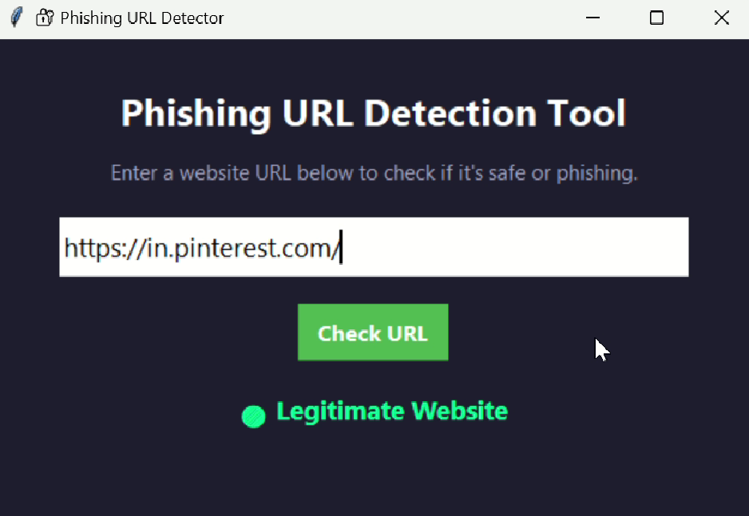

# Phishing URL Detector 🔗🛡️

A cross-platform, machine learning-powered tool to detect phishing websites in real time by analyzing URL features.  
**Empowering users with instant security feedback and educational insights.**

## 🚀 Overview

Phishing attacks are a leading cybersecurity threat, tricking users into revealing sensitive information via deceptive websites.  
**Phishing URL Detector** leverages advanced feature engineering and a trained Random Forest model to identify suspicious URLs—even those never seen before.  
With a modern, user-friendly interface and actionable feedback, this tool helps everyone browse more safely.

## ✨ Features

- **Real-time URL analysis and prediction**
- **Advanced feature extraction:** URL length, subdomains, IP usage, HTTPS, special characters, obfuscation ratio, and more
- **Machine learning-based detection** (Random Forest)
- **Instant, color-coded feedback** (Legitimate or Phishing)
- **Educational explanations** to build user awareness
- **Cross-platform GUI** (Windows, Linux, macOS)
- **Privacy-first:** All processing is local; no data leaves your device

## 🖥️ Demo

 


## 📦 Installation

### Prerequisites

- Python 3.7 or newer
- pip (Python package manager)

### Clone the Repository

```bash
git clone https://github.com/abireshu/Phishing-url-detector-with-machine-learning.git
cd Phishing-url-detector-with-machine-learning.git
```

### Install Dependencies

```bash
pip install -r requirements.txt
```

**Dependencies include:**  
- pandas  
- scikit-learn  
- joblib  
- tkinter (usually included with Python)  

## 🛠️ Usage

1. **Train the Model** (if not using the provided `Trained_model.pkl`):

    - Place your labeled dataset as `Dataset.csv` in the project directory.
    - Run the training script:

    ```bash
    python train_model.py
    ```

2. **Run the Detector GUI:**

    ```bash
    python phising_url_detector.py
    ```

3. **Check a URL:**
    - Paste any URL into the input box.
    - Click “Check URL.”
    - Instantly see if it’s **Legitimate** or **Phishing**, with a brief explanation.

## 🧠 How It Works

1. **Feature Extraction:**  
   Each URL is broken down into numerical features (length, subdomain count, IP/domain, HTTPS, special characters, etc.).

2. **Prediction:**  
   The trained Random Forest model analyzes these features to predict if the URL is legitimate or phishing.

3. **User Feedback:**  
   Results are displayed in a modern GUI with clear color coding and educational tips.

## 📂 Project Structure

```
phishing-url-detector/
│
├── phising_url_detector.py        # Main GUI application
├── feature_extraction.py          # URL feature extraction module
├── train_model.py                 # Model training script
├── Trained_model.pkl              # Pre-trained Random Forest model
├── Dataset.csv                    # (Optional) Training dataset
├── requirements.txt               # Python dependencies
└── README.md                      # Project documentation
```

## 🛡️ Security & Privacy

- **Passive analysis:** The tool does not connect to or interact with URLs.
- **Local processing:** No URLs or user data are sent to external servers.
- **Educational focus:** Users learn *why* a URL is suspicious, not just that it is.

## 📚 References

- [scikit-learn Documentation](https://scikit-learn.org/)
- [OWASP Phishing Prevention Cheat Sheet](https://cheatsheetseries.owasp.org/cheatsheets/Phishing_Prevention_Cheat_Sheet.html)
- [Python Official Documentation](https://docs.python.org/3/)

## 🙌 Contributing

Contributions, issues, and feature requests are welcome!  
Please open an [issue](https://github.com/abireshu/Phishing-url-detector-with-machine-learning/issues) or submit a pull request.


## 👩‍💻 Author

**Abinaya Balakrishnan**  
